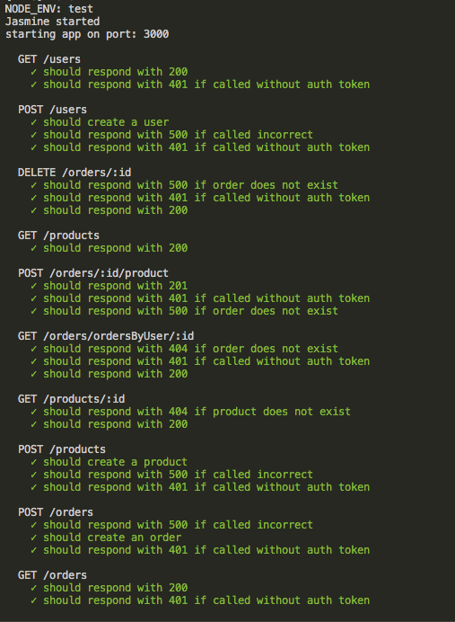
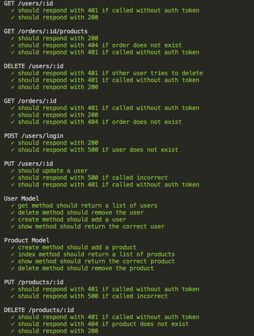
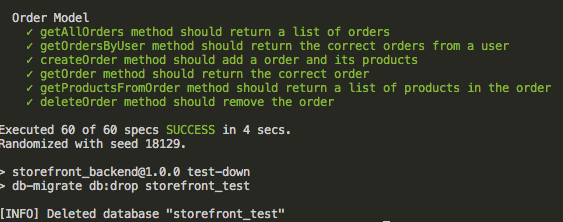

# Storefront_Backend

## Project Summary

Build a JavaScript API based on a requirements given by the stakeholders. You will architect the database, tables, and columns to fulfill the requirements. Create a RESTful API to be accessible to the frontend developer. You will also have written test, secured user information with encryption, and provide tokens for integration into the frontend.

## Scripts

Run prettier

```bash
  npm run prettier
```

Run lint

```bash
  npm run lint
```

Run tests

```bash
  npm run test
```

Start the dev server

```bash
  npm run watch
```

Build the project

```bash
  npm run build
```

Run the application

```bash
  npm run start
```

## Run Locally

Clone the project

```bash
  git clone https://github.com/AndrewGithinji/StoreFront_Backend.git
```

Go to the project directory

```bash
  cd storefront-backend/
```

Install dependencies

```bash
  npm install
```

Set up the `.env` file for connecting to the database and a working authorization. `.env.example` file is provided with needed keys

Run the migrations

```bash
  db-migrate up
```

Start the docker postgres container

```bash
  docker-compose up -d
```

Start the dev server

```bash
  npm run watch
```

Application will run on port 3000

## Running Tests

To run tests, run the following command

```bash
  npm run test
```
## Image of tests passing




## Author

Rancy Chepchirchir ((https://github.com/RancyChepchirchir))
